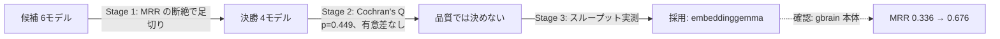
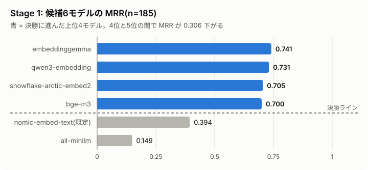
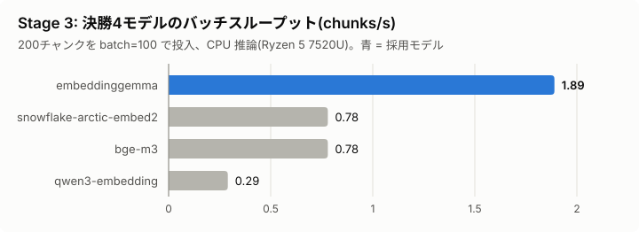

# gbrain-embedding-eval

RAG基盤 [gbrain](https://github.com/garrytan/gbrain) の埋め込みモデルを、事前に決めた
「足切り → 有意差検定 → 実測で決着」の手順で選び直した検証ハーネスと、その結果。

## 結論

**`embeddinggemma`(308M)を採用した。** 品質では決勝4モデルの間に有意差を検出できなかったため、
事前に決めたとおりタイブレーカー(バッチスループット)で決着させた。embeddinggemma は2位以下の 2.4〜6.5 倍速かった。

| Stage | 何をしたか | 結果 |
| --- | --- | --- |
| 1. 足切り | 候補6モデルを Recall@10 / MRR で順位付け | 上位4モデルが MRR 0.700〜0.741 に密集し、5位(既定の nomic-embed-text)は 0.394 と断絶。上位4を決勝へ |
| 2. 有意差検定 | 決勝4モデルの hit@10 に Cochran's Q 検定(N=185) | Q=2.65, df=3, **p=0.449**。有意差を検出できず、事後の McNemar 検定には進まない |
| 3. タイブレーカー | 単発レイテンシとバッチスループットを実測 | 単発は横並び(差6%以内)。スループットで embeddinggemma が 1.89 chunks/s と最速 |



選定後、gbrain 本体で同じ185件を移行前後に流して確認した。MRR は 0.336 → 0.676 に上がった(「gbrain 本体での確認」の節)。

解説記事: [gbrainの埋め込みモデルを個人最適化したら、検索精度がほぼ倍になった(Zenn)](https://zenn.dev/yuya0408/articles/gbrain-embedding-eval)

## なぜ選び直したか

gbrain の Ollama 向けレシピは `nomic-embed-text`(768次元)を既定にしている。これは「とりあえず動く」ための選択で、
手元のコーパスで最も精度が出るとは限らない。gbrain はチャンク分割や検索パイプラインを内蔵している一方、
埋め込みモデルは差し替えられるようになっており、検索精度に直接効く。そこで候補を Ollama 公式ライブラリの埋め込みモデル6つに絞り、比較した。

## 評価セット

- コーパス: gbrain に取り込んだ自分のメモ・記事 521 チャンク
- クエリ 185 件
  - 手動作成 35 件: 正解はページ単位(slug 一致)
  - 合成 150 件: チャンク本文から `qwen3.5:4b` に質問を生成させたもの。正解は生成元チャンク(`chunk_id` 完全一致)

合成クエリが 8 割を占めるため、Recall / MRR の絶対値は実際の利用時より高めに出る。この評価で見るのはモデル間の相対順位。

## Stage 1: 足切り

コサイン類似度の top-10 で、Recall@10(正解が上位10件に入った割合)と MRR を算出した(n=185)。



| モデル | Recall@10 | MRR | |
| --- | --- | --- | --- |
| embeddinggemma | 0.919 | **0.741** | 決勝へ |
| qwen3-embedding | 0.908 | 0.731 | 決勝へ |
| snowflake-arctic-embed2 | 0.886 | 0.705 | 決勝へ |
| bge-m3 | 0.908 | 0.700 | 決勝へ |
| nomic-embed-text(既定) | 0.632 | 0.394 | |
| all-minilm | 0.314 | 0.149 | |

4位と5位の間で MRR が 0.306 下がる。この断絶を決勝進出の線にした[^ruri]。

## Stage 2: 決勝の有意差検定

決勝の設計は検定を回す前に決めておいた。

1. 4モデルの hit@10(クエリごとの当たり/外れ)に Cochran's Q 検定を1回だけかける
2. 有意なら、全6ペアに exact McNemar 検定(Holm 補正)をかけて優劣を決める
3. 有意でなければ、品質での比較はここで止め、Stage 3 の実測で決める

結果は `Q = 2.6512, df = 3, p = 0.4486`。手順3に進んだ。

これは「4モデルが同等だと示した」ことを意味しない。「N=185 では差を検出できなかった」という結論にとどまる。
hit@10 は 4モデルとも 0.886〜0.919 と上限近くにあり、片方だけが当たるクエリが少ない。
順位差に敏感な hit@1 でも事後的に同じ検定をかけたが、結論は変わらなかった(Q=4.26, df=3, p=0.235)。

## Stage 3: レイテンシ/スループット

CPU 推論のノートPC(Ryzen 5 7520U、メモリ16GB、専用GPUなし、Ollama 0.34.3)で測った。

- 単発レイテンシ: 短いクエリ1件を15回投げた中央値
- バッチスループット: コーパスの200チャンクを gbrain 本体と同じ batch=100 で投入



| モデル | パラメータ | 次元 | 単発(中央値, ms) | 200件の所要時間(s) | スループット(chunks/s) |
| --- | --- | --- | --- | --- | --- |
| **embeddinggemma** | **308M** | 768 | 2104 | **105.8** | **1.89** |
| snowflake-arctic-embed2 | 567M | 1024 | 2199 | 256.5 | 0.78 |
| bge-m3 | 567M | 1024 | 2195 | 254.9 | 0.78 |
| qwen3-embedding | 596M | 1024 | 2076 | 683.4 | 0.29 |

単発レイテンシはモデルを区別できず、差はスループットにだけ出た。スループットはモデル切り替え時の全件再埋め込みや
初回取り込みの時間を決める。521 チャンクなら embeddinggemma で約5分、qwen3-embedding で約30分かかる。
batch=32 でも順位は変わらなかった。

## gbrain 本体での確認

選定の根拠は Stage 1〜3 だけで、この節は「選んだモデルが実際の検索経路でも劣化しないか」の確認にあたる。
同じ185件を gbrain に投げ、移行前(nomic-embed-text)と移行後(embeddinggemma)で正解の順位を比べた。
検索経路は BM25 とベクトル検索のハイブリッド(RRF 融合)で、reranker は無効の設定。

| 指標 | nomic-embed-text(移行前) | embeddinggemma(移行後) |
| --- | --- | --- |
| hit@1 | 48/185 (25.9%) | 109/185 (58.9%) |
| hit@3 | 68/185 (36.8%) | 138/185 (74.6%) |
| hit@10 | 93/185 (50.3%) | 147/185 (79.5%) |
| MRR | 0.336 | 0.676 |

hit@10 で片方だけが当たったクエリは、移行後のみ 57 件、移行前のみ 3 件だった。

## 再現手順

前提: Ollama が `localhost:11434` で起動しており、`model_config.py` の各モデルと `qwen3.5:4b` を pull 済み。

```bash
# 準備: gbrain の PGLite からチャンクを書き出し、合成クエリを生成
GBRAIN_DIR=<gbrainのPGLiteデータディレクトリ> npx tsx export_chunks.ts data/chunks.jsonl
# 評価対象から外したいページ(個人的なメモ等)の行を除いて data/chunks_eval.jsonl を作る
# (今回は1ページ・14チャンクを除外し、535→521チャンク)
CHUNKS_PATH=data/chunks_eval.jsonl OUT_PATH=data/auto_queries.jsonl python gen_synthetic_queries.py

python embed_all.py             # 全候補でコーパスとクエリを埋め込む
python screen.py                # Stage 1: Recall@10 / MRR
python finals.py                # Stage 2: Cochran's Q(有意なら Holm 補正つき McNemar)
python measure_latency.py 100   # Stage 3: batch=100 で計測
```

手動作成クエリは `data/curated_queries.jsonl` に `{"query_id", "query_text", "gold_slug"}` 形式で置く。

| ファイル | 役割 |
| --- | --- |
| `export_chunks.ts` | gbrain の PGLite からチャンクを JSONL に書き出す |
| `gen_synthetic_queries.py` | チャンクごとに合成クエリを生成する |
| `model_config.py` | 候補モデルのタグ・クエリ/文書プレフィックス・文字数上限 |
| `embed_all.py` / `screen.py` / `finals.py` / `measure_latency.py` | Stage 1〜3 |
| `diagnostics/` | 本筋の結果には使っていない補助スクリプト(Ollama の疎通確認、ruri のスコア低下の切り分け) |

## データについて

`data/` は個人のナレッジベース由来のため公開していない(`.gitignore` 済み)。この README の数値は集計値のみ。
自分の gbrain コーパスに対して上記の手順を実行すれば、同じ評価を再現できる。

[^ruri]: `model_config.py` に残っている `ruri`(日本語特化モデル)は Ollama ではサードパーティ提供版しか使えないため、
公式ライブラリに限るという候補条件から外した。参考値は Recall@10 0.616 / MRR 0.395 で、決勝ラインにも届いていない。
